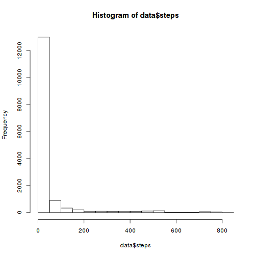
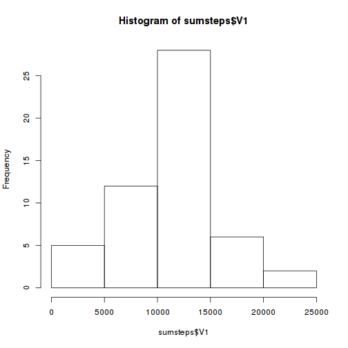
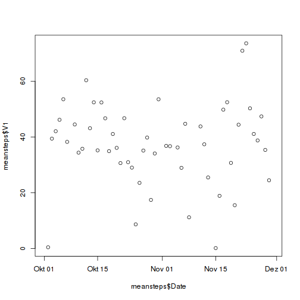

Project 1 in reproducible research
==================================

The data given represents the activity data of a anonymous person, tracked with a unknown activity monitoring device in 2 month in 2012.

## Task 1: download and load the data

First download the data via the download function in the helper functions script

```r
source('helperfunctions.R')
get_download('activity.zip')
```

```
## [1] TRUE
```

```r
data <- read_data('./data/activity.csv')
data$Date <- as.Date(data$date, format="%Y-%m-%d")
hist(data$steps)
```



## Task 2: Calculate the mean number of steps in every day

To compute the mean and the median number of steps per day and the sum of steps per day the data.table package is used.


```r
library('data.table')
DT <- data.table(data)
meansteps <- DT[, mean(steps), by=Date]
sumsteps <- DT[, sum(steps), by=Date]
#mediansteps <- DT[, median(steps, na.rm=TRUE), by=Date]
hist(sumsteps$V1)
```



```r
plot(meansteps$Date, meansteps$V1)
```



```r
#plot(mediansteps$Date, mediansteps$V1)
```

The mean of steps taken every day is 1.0766189 &times; 10<sup>4</sup> and the median is 10765

## Task 3: What is the average daily activity pattern


## Task 4: Comparing tidy and original data

## Task 5: Differences between weekdays and weekends
